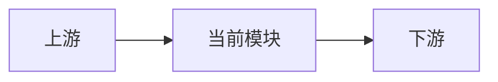

# 开篇：什么是 <TOPIC>，为什么需要它

> 源码基准：<SOURCE_BASELINE>
> 本章目标：<LEARNING_GOAL>

## 一个具体场景

<REAL_SCENARIO>

## 建立直觉

<ANALOGY_AND_BOUNDARY>

## 在项目中的位置

<POSITION_TEXT>

仅在关系复杂时保留：

## 必要背景

> 📦 **额外知识：<OPTIONAL_TERM>**
>
> <ONLY_KEEP_IF_NEEDED>

## 源码入口

- <SOURCE_LINK_OR_LOCATION>，符号 <SYMBOL>：<WHY_START_HERE>

> 💡 **一句话记住**：<TAKEAWAY>

<!-- 删除占位符、不需要的图和知识框。多文件的实质性章节各保留一个章末总结。 -->
