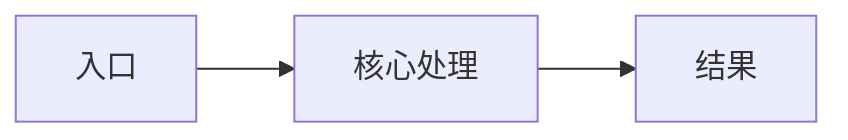

# <TOPIC> 深度讲解

> 目标读者：<AUDIENCE>
> 范围：<SCOPE>

<!-- 只有版本差异影响内容或项目规范要求时，才补充版本上下文。 -->

## 阅读路线

| 读者 | 建议路线 |
| --- | --- |
| 新人 | 范围与类比 → 全景 → 主流程 → 常见坑 → 源码索引 |
| 有经验开发者 | 全景 → 职责边界 → 实现观察或设计决策 → 失败路径 |

删除不适用的路线，并确保路线文字与下方真实标题一致。

## 先用一个场景理解它

<REAL_SCENARIO_AND_ANALOGY>

说明类比能解释什么，以及不能解释什么。

## 全景

<OVERVIEW_TEXT>

仅在三个以上组件或三跳以上流程时保留 Mermaid 图：

## 一步步走主流程

### Step 1：<STEP_TITLE>

**做什么**：<INPUT_PROCESS_OUTPUT>

**源码**：<SOURCE_LINK_OR_LOCATION>

**依据或原因**：<EVIDENCE_OR_LABELED_INFERENCE>

### Step 2：<STEP_TITLE>

**做什么**：<INPUT_PROCESS_OUTPUT>

**源码**：<SOURCE_LINK_OR_LOCATION>

**依据或原因**：<EVIDENCE_OR_LABELED_INFERENCE>

按实际主流程增删步骤，不要保留空步骤。

## 核心对象与职责边界

| 对象或文件 | 职责 | 调用方 | 下游 | 源码 |
| --- | --- | --- | --- | --- |
| <NAME> | <RESPONSIBILITY> | <CALLER> | <DEPENDENCY> | <SOURCE_LINK_OR_LOCATION> |

## 实现观察与设计决策

### <OBSERVATION_OR_DECISION>

- 当前实现：<CURRENT_BEHAVIOR>
- 证据：<SOURCE_OR_TEST>
- 理由：已确认 / 推测 / 未知
- 维护影响：<MAINTENANCE_IMPACT>

没有设计理由证据时，保留“实现观察”，不要虚构决策背景。

> 📦 **额外知识：<OPTIONAL_BACKGROUND>**
>
> <ONLY_KEEP_IF_NEEDED>

## 演进与设计意图（仅 Git 历史模式）

普通教程删除本节。启用历史模式时，只保留能解释当前结构的关键节点。

| 时间与提交 | 发生了什么 | 原因与证据等级 | 如何影响当前设计 |
| --- | --- | --- | --- |
| <DATE_AND_SHORT_COMMIT> | <OBSERVED_CHANGE> | <STATED_INFERRED_OR_UNKNOWN> | <CURRENT_CODE_OR_TEST> |

### 修改护栏

- 不要轻易破坏：<HISTORICAL_EVIDENCE_AND_CURRENT_GUARD>
- 可以安全调整：<SAFE_CHANGE_WITH_REASON>
- 候选风险或待确认：<RISK_OR_UNKNOWN>

## 常见坑、失败路径与扩展点

| 场景 | 当前行为 | 证据 | 建议 |
| --- | --- | --- | --- |
| <CASE> | <BEHAVIOR> | <SOURCE_OR_TEST> | <ACTION> |

## 理解检查或面试 Q&A（可选）

只有用户要求练习或面试准备时保留本节。

### Q：<QUESTION>

**回答**：<ANSWER>

**证据**：<SOURCE_OR_TEST>

## 源码索引

| 文件 | 符号 | 在教程中的作用 |
| --- | --- | --- |
| <SOURCE_LINK_OR_PATH> | <SYMBOL> | 
 |

## 未确认项

- <UNKNOWN_OR_MAINTAINER_QUESTION>

> 💡 **一句话记住**：<ONE_SENTENCE>

<!--
交付前：
1. 删除所有占位符、填写提示和不适用章节。
2. 单文件只保留文末一个“💡 一句话记住”。
3. 不使用 file:/// 或本机用户目录绝对路径。
4. 运行 validate_tutorial.py 并完成人工验收。
-->
